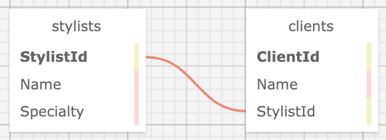

# _Eau Claire's Salon_

#### By Molly Donegan

#### _An MVC web application to help Claire manage her employees and their clients. Claire is able to add a list of stylists working at the salon, and for each stylist, add clients who see that stylist._

## Technologies Used

* _C#_
* _.NET_
* _MVC_
* _SQL Workbench_
* _Entity Framework_

## Setup/Installation Requirements

* _Clone this repository._
* _Open your terminal (e.g., Terminal or GitBash) and navigate to this project's production directory called "HairSalon"._
* _This program was built using `Microsoft .NET SDK 6.0`, and may not be compatible with other versions._
*  _Open the browser to [https://localhost:5001]. If you cannot access localhost:5001 it is likely because you have not configured a .NET developer security certificate for HTTPS. To learn about this, visit: [Redirecting to HTTPS and Issuing a Security Certificate.](https://www.learnhowtoprogram.com/c-and-net/basic-web-applications/redirecting-to-https-and-issuing-a-security-certificate)_

## SQL Workbench Configuration
* _Create an `appsetting.json` file in the "HairSalon" directory of the project._
* _Within `appsettings.json`, put in the following code, replacing the `uid` and `pwd` values with your own username and password for MySQL._ 
```json
{
    "ConnectionStrings": {
        "DefaultConnection": "Server=localhost;Port=3306;database=hair_salon;uid=[YOUR-USERNAME-HERE];pwd=[YOUR-PASSWORD-HERE];"
    }
}
```
* _If you'd like to push this cloned project to a public-facing repository, remember to add the appsettings.json file to your .gitignore first._
* _Once "appsettings.json" file has been created, navigate back to SQL Workbench._ 
* _Import the database named ``"molly_rose_donegan.sql"`` from the root directory of the project._ 

## Database Import Instructions

* _Open SQL workbench._
* _Navigate to the "Administration" tab in SQL Workbench._
* _Click ``"Data Import/Restore"``_
* _Select the radio button "Import from Self-Contained File" and include file path to the sql file of this project that has been cloned to your machine._
* _In "Default Schema to be Imported to" click "New"._
* _Name the schema ``"hair_salon"`` then click "OK"._
* _Once named, switch to ``"Import Progress"`` tab and click ``"Start Import"``._
* _In the command line, run the command ``dotnet run`` to compile and execute the application._
* _Optionally, you can run ``dotnet build`` to compile this app without running it._

## Database Relationship Visualization



## Known Bugs

* _NA_

* _Please reach out with any questions or concerns [mollyrdonegan@gmail.com](mollyrdonegan@gmail.com)_

## License

_[MIT](https://github.com/mdonegan91/EauClairesSalon.Solution/blob/main/LICENSE)_

Copyright (c) _2023_ _Molly Donegan_